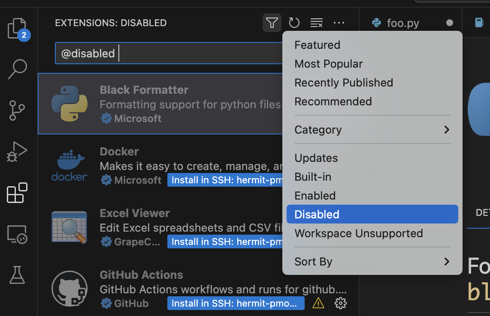

# Treetop

A command-line tool for managing EC2 development instances. Launch, start, stop, connect to, and terminate instances from your terminal.

## Installation

```sh
pip install treetop
```

Or from source:

```sh
git clone <repository-url>
cd treetop
pip install -e .
```

## Quick Start

```sh
# Configure your AWS environment (interactive)
treetop init

# Launch a new instance
treetop launch my-dev-box

# Connect via SSH
treetop connect my-dev-box

# Stop when done (preserves the instance)
treetop down my-dev-box

# Start it again later
treetop up my-dev-box
```

## Commands

| Command | Description |
|---------|-------------|
| `treetop init` | Configure AWS region, SSH key, and launch template |
| `treetop launch <name>` | Create a new instance from a launch template |
| `treetop up <name>` | Start a stopped instance |
| `treetop down <name>` | Stop an instance (preserves it) |
| `treetop status [name]` | Show status of all or a specific instance |
| `treetop connect [name]` | SSH into an instance |
| `treetop add` | Register an existing instance not created by treetop |
| `treetop delete <name>` | Terminate an instance permanently |
| `treetop create-template <name>` | Create a new EC2 launch template |

### launch

```sh
treetop launch <name> [--launch-template-id ID] [--instance-type TYPE]
```

- `--launch-template-id`: Override the configured launch template
- `--instance-type`: Override the configured instance type (e.g., `t2.medium`, `g5.xlarge`)
- `-v, --verbose`: Show detailed launch progress

### create-template

```sh
treetop create-template <name> --ami-id AMI --security-group-ids SG --subnet-id SUBNET [--efs-id EFS] [--volume-size GB]
```

Creates a launch template in your AWS account. All required parameters can be pre-configured via `treetop init`.

## AWS Prerequisites

1. **IAM permissions** — see [docs/iam-permissions.md](docs/iam-permissions.md)
2. **VPC with a subnet** — instances launch into the subnet specified in your launch template
3. **Security group** — must allow SSH (port 22) from your network
4. **SSH key pair** — registered in EC2 and available locally
5. **AMI** — the machine image your instances will boot from

For a full walkthrough, see [docs/setup-guide.md](docs/setup-guide.md).

## Connecting VSCode

Treetop automatically manages your `~/.ssh/config` entries. To connect VSCode:

1. Install the "Remote-SSH" extension
2. Open the Command Palette and select "Remote-SSH: Connect to Host..."
3. Select the instance name (it appears as an SSH host automatically)



Note: After connecting, some extensions may show as disabled. Filter the extensions panel to "disabled" and click "Install in SSH" for any you need on the remote host.

## Configuration

Configuration is stored in `~/.treetop/config.json`:

```json
{
  "ssh_key_name": "my-key",
  "ssh_key_location": "~/.ssh/my-key.pem",
  "aws": {
    "region": "us-east-1",
    "launch_template_id": "lt-xxxxx",
    "default_instance_type": "t2.medium"
  },
  "template_defaults": {
    "ami_id": "ami-xxxxx",
    "security_group_ids": ["sg-xxxxx"],
    "subnet_id": "subnet-xxxxx",
    "efs_id": null,
    "volume_size": 30
  }
}
```

Run `treetop init` to create or update this file interactively.

## License

MIT
